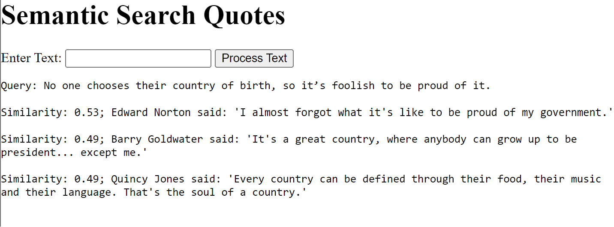

# Ancient Wisdom

## Current Functionality
Semantic search 50k famous quotes using a simple website design.

## Idea
Many arguments we have today are ancient ones. For example, multiculturalism and immigration policy was debated in the Roman times. However, it is hard to access the ideas of our collective human history. The classics use different terminology, and so using a keyword search often fails. I wanted to test if semantic search increases accessibility. 

I have two thoughts on this matter. 
1. Semantic Search is usually better than key word. So, worth a shot.
2. AI experiments in translating languages has revealed that absent outside context (e.g. Rosetta Stone), AI can translate any human language with sufficient data. This implies that humans are born with an innate understanding of how language works supporting the theory of [Language Instinct](https://en.wikipedia.org/wiki/The_Language_Instinct#:~:text=Language%20(speech)%20also%20develops%20in,is%20an%20innate%20human%20ability.). I wonder if AI can similarly decipher human history. 

## TODO
* Parse and embed classics such as the Mahbarta, Iliad, and more
* Add bells and whistles to website

### Example Usage
Questions taken from the [Political Compass Test](https://www.politicalcompass.org/test)

### Some mistakes:
Note: 3 duplicate responses. 
